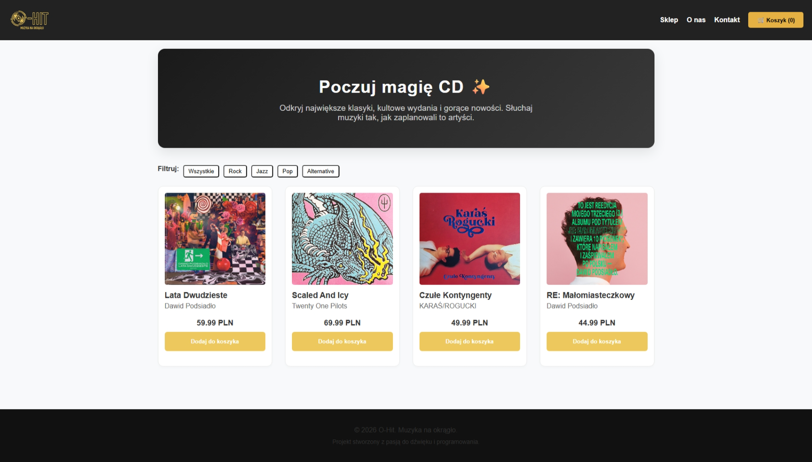
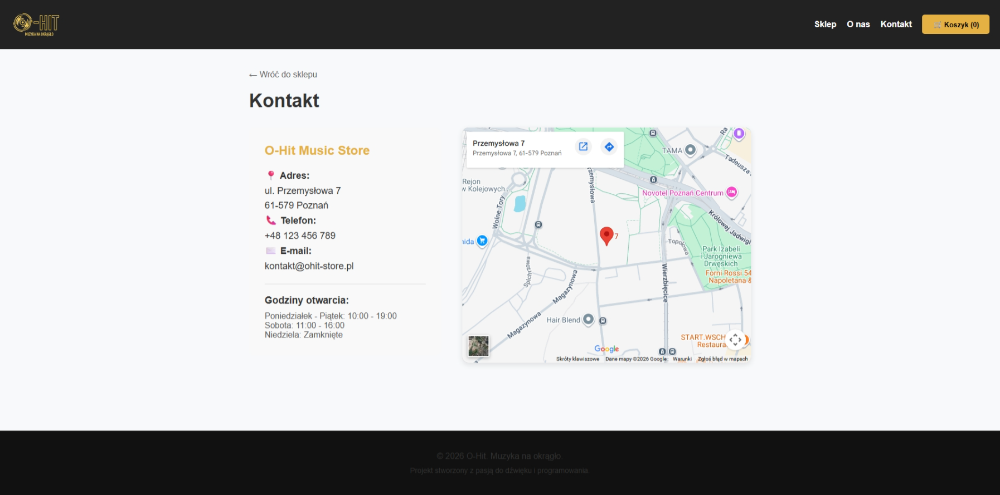
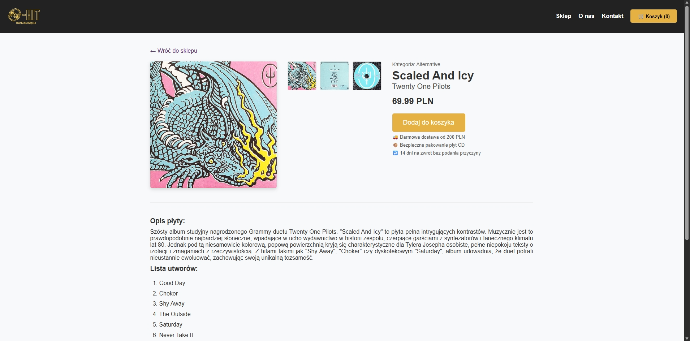

# O-Hit Music Store 💿

A modern, responsive Single Page Application (SPA) built with React. This project simulates a professional e-commerce experience for music enthusiasts, focusing on clean UI, smooth navigation, and persistent user data.

## 🚀 Features

- **Responsive Web Design (RWD):** Fully optimized for mobile, tablet, and desktop using pure CSS (Flexbox & Grid).
- **Dynamic Shopping Cart:** Real-time item tracking with data persistence.
- **State Persistence:** Cart data is saved in `localStorage`, ensuring the user's progress isn't lost after a page refresh.
- **Interactive Product Gallery:** Custom-built image gallery with state-driven thumbnail switching.
- **SPA Routing:** Seamless transitions between the store, product details, and contact pages using `React Router`.
- **Mobile Navigation:** Interactive "hamburger" menu tailored for mobile users.

## 🛠️ Tech Stack

- **Frontend:** React.js
- **Routing:** React Router DOM
- **Styling:** CSS3 (Custom properties, Media Queries, Grid, Flexbox)
- **State Management:** React Hooks (`useState`, `useEffect`)
- **Storage:** Web Storage API (LocalStorage)

## 🤖 AI-Assisted Development & Interactive Learning

This project was built as a hands-on introduction to React and modern web development. To maximize my learning efficiency, I used AI not just as a code generator, but as an **interactive tutor and senior mentor**. 

**My unique learning workflow included:**
- **Foundational Scaffolding:** I used AI to generate the initial boilerplate and component structures, allowing me to focus on learning React's core logic rather than getting stuck on setup.
- **Task-Based Learning:** I specifically prompted the AI to leave crucial parts of the logic (like state management, routing, or specific CSS layouts) blank, turning them into coding assignments. I then manually wrote the code to complete these tasks.
- **Code Review & Debugging:** After completing my assignments, I used the AI to review my code, explain where I made mistakes, and guide me toward best practices (e.g., refactoring inline styles, understanding `useEffect` dependencies).
- **Reverse-Engineering:** Analyzing the AI-generated parts of the codebase to deeply understand how complex React Hooks and TypeScript interfaces interact.

*This "mentor-student" dynamic allowed me to build a complex, fully functional SPA while ensuring I actively understood and wrote the critical logic myself.*

## 📸 Preview

